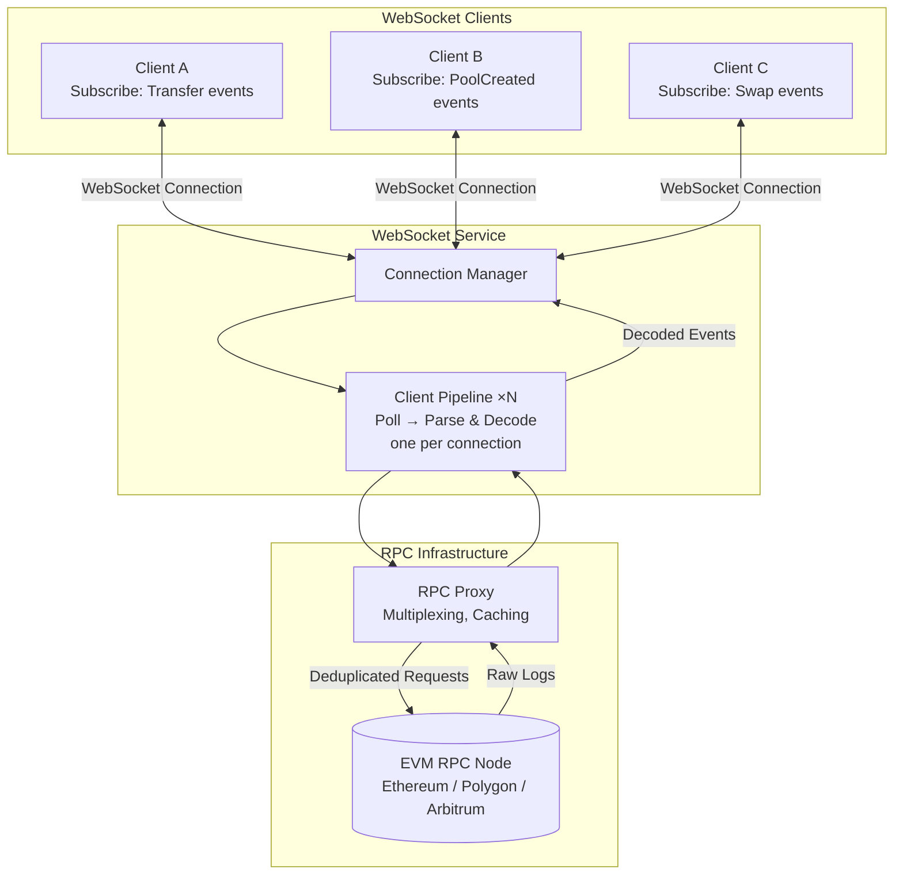
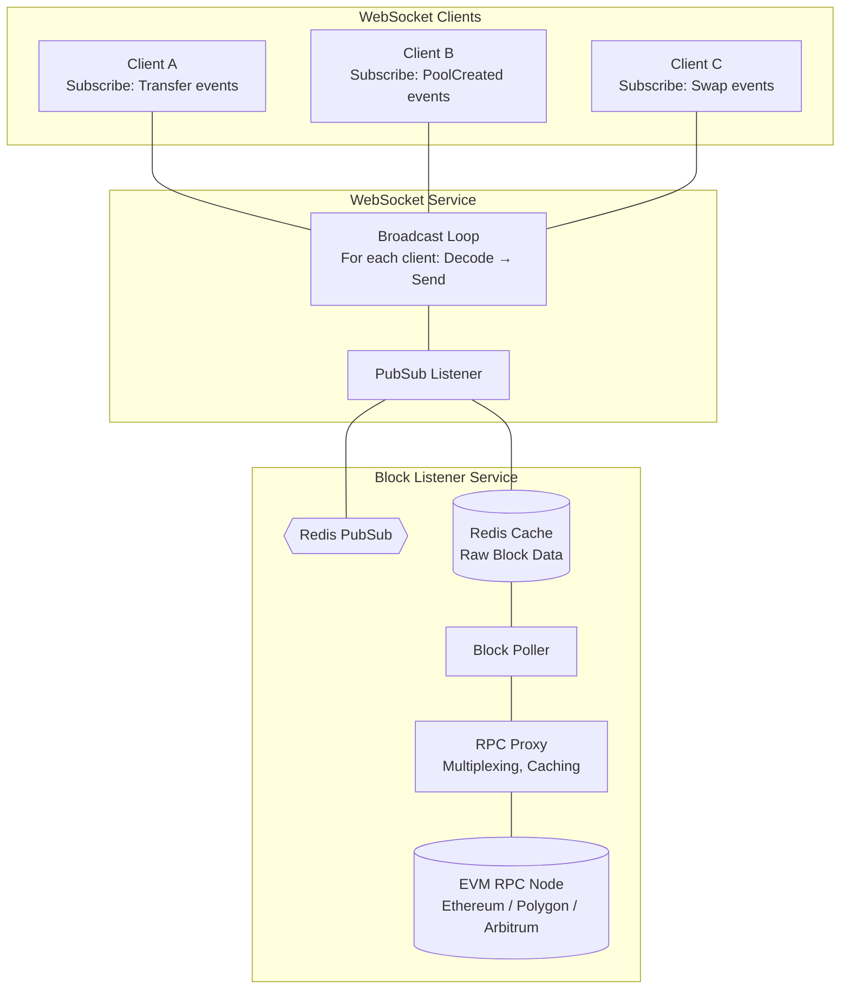

# evm-event-indexer

## Table of Contents

- [WebSocket Service](#websocket-service)
  - [Overview](#overview)
  - [Connection](#connection)
    - [Using wscat](#using-wscat)
  - [Subscription Message](#subscription-message)
    - [Request Format](#request-format)
    - [Request Parameters](#request-parameters)
  - [Response Format](#response-format)
    - [Decoded Events Response](#decoded-events-response)
    - [Raw Events Response](#raw-events-response)
    - [Response Fields](#response-fields)
  - [Example Usage](#example-usage)
    - [Listening to Uniswap V3 Factory Pool Creation (Decoded)](#listening-to-uniswap-v3-factory-pool-creation-decoded)
    - [Multiple Event Subscriptions](#multiple-event-subscriptions)
    - [Listen to All Contracts](#listen-to-all-contracts)
  - [Notes](#notes)
- [WebSocket Architecture Design](#websocket-architecture-design)
  - [Method 1: Per-Client Polling](#method-1-per-client-polling)
  - [Method 2: Shared Cache with Pub/Sub Broadcast](#method-2-shared-cache-with-pubsub-broadcast)
  - [Method 3: Persistent Queue with RabbitMQ](#method-3-persistent-queue-with-rabbitmq)
- [Webhook Service](#webhook-service)
  - [Overview](#overview-1)
  - [Registering a Webhook](#registering-a-webhook)
    - [Endpoint](#endpoint)
    - [Request](#request)
    - [Request Parameters](#request-parameters-1)
    - [Response](#response)
  - [Deregistering a Webhook](#deregistering-a-webhook)
  - [Webhook Payload](#webhook-payload)
    - [Decoded Events Payload](#decoded-events-payload)
    - [Raw Events Payload](#raw-events-payload)
  - [Response Requirements](#response-requirements)
  - [Example: Uniswap V3 Pool Creation](#example-uniswap-v3-pool-creation)

---

# WebSocket Service

Real-time EVM event streaming service for subscribing to blockchain events with optional decoding.

## Overview

The WebSocket service enables clients to receive real-time notifications for specific EVM events. You can subscribe to events by specifying contract addresses, event signatures (topic_0), and whether you want the events decoded or returned in raw format.

## Connection

Connect to the WebSocket endpoint:

```
wss://stream.yourdomain.com/v1/events
```

### Using wscat

Install wscat if you haven't already:

```bash
npm install -g wscat
```

Connect to the service:

```bash
wscat -c wss://stream.yourdomain.com/v1/events
```

## Subscription Message

After connecting, send a subscription message to start receiving events.

### Request Format

```json
{
  "type": "subscribe",
  "chain": "ethereum",
  "decode": true,
  "topics": [
    "0x783cca1c0412dd0d695e784568c96da2e9c22ff989357a2e8b1d9b2b4e6b7118",
    "0xddf252ad1be2c89b69c2b068fc378daa952ba7f163c4a11628f55a4df523b3ef"
  ],
  "addresses": [
    "0x1F98431c8aD98523631AE4a59f267346ea31F984",
    "0xC02aaA39b223FE8D0A0e5C4F27eAD9083C756Cc2"
  ]
}
```

### Request Parameters

| Parameter | Type | Required | Description |
|-----------|------|----------|-------------|
| `type` | string | Yes | Must be `"subscribe"` to initiate a subscription |
| `chain` | string | Yes | The blockchain network (e.g., `"ethereum"`, `"polygon"`, `"arbitrum"`) |
| `decode` | boolean | Yes | Whether to decode events (`true`) or return raw logs (`false`) |
| `topics` | array | Yes | Array of event signature hashes (topic_0) to monitor |
| `addresses` | array | No | Array of contract addresses to monitor. If omitted, listens to all contracts emitting the specified topics |

## Response Format

The service streams events matching your filters in real-time. Each message includes the block number and an array of events from that block.

### Decoded Events Response

When `decode: true`, events are returned with parsed parameters:

```json
{
  "block_number": 18500123,
  "data": [
    {
      "event_name": "PoolCreated",
      "address": "0x1F98431c8aD98523631AE4a59f267346ea31F984",
      "transaction_hash": "0xabc123...",
      "log_index": 42,
      "parameters": {
        "token0": "0xA0b86991c6218b36c1d19D4a2e9Eb0cE3606eB48",
        "token1": "0xC02aaA39b223FE8D0A0e5C4F27eAD9083C756Cc2",
        "fee": 3000,
        "tickSpacing": 60,
        "pool": "0x8ad599c3A0ff1De082011EFDDc58f1908eb6e6D8"
      }
    }
  ]
}
```

### Raw Events Response

When `decode: false`, events are returned as raw log objects:

```json
{
  "block_number": 18500123,
  "data": [
    {
      "address": "0x1F98431c8aD98523631AE4a59f267346ea31F984",
      "topics": [
        "0x783cca1c0412dd0d695e784568c96da2e9c22ff989357a2e8b1d9b2b4e6b7118",
        "0x000000000000000000000000a0b86991c6218b36c1d19d4a2e9eb0ce3606eb48",
        "0x000000000000000000000000c02aaa39b223fe8d0a0e5c4f27ead9083c756cc2"
      ],
      "data": "0x0000000000000000000000000000000000000000000000000000000000000bb8000000000000000000000000000000000000000000000000000000000000003c0000000000000000000000008ad599c3a0ff1de082011efddc58f1908eb6e6d8",
      "block_hash": "0xdef456...",
      "block_number": 18500123,
      "transaction_hash": "0xabc123...",
      "transaction_index": 15,
      "log_index": 42,
      "removed": false
    }
  ]
}
```

### Response Fields

#### Common Fields

| Field | Type | Description |
|-------|------|-------------|
| `block_number` | integer | The block number where the event(s) occurred |
| `data` | array | Array of event objects (decoded or raw based on subscription) |

#### Decoded Event Fields

| Field | Type | Description |
|-------|------|-------------|
| `event_name` | string | Human-readable name of the event |
| `address` | string | Contract address that emitted the event |
| `transaction_hash` | string | Transaction hash containing the event |
| `log_index` | integer | Index of the log within the block |
| `parameters` | object | Decoded event parameters as key-value pairs |

#### Raw Event Fields

| Field | Type | Description |
|-------|------|-------------|
| `address` | string | Contract address that emitted the event |
| `topics` | array | Array of indexed event parameters (topic_0 is event signature) |
| `data` | string | Non-indexed event parameters as hex-encoded data |
| `block_hash` | string | Hash of the block containing this log |
| `block_number` | integer | Block number containing this log |
| `transaction_hash` | string | Transaction hash containing the event |
| `transaction_index` | integer | Transaction's index position in the block |
| `log_index` | integer | Log's index position in the block |
| `removed` | boolean | Whether the log was removed due to chain reorganization |

## Example Usage

### Listening to Uniswap V3 Factory Pool Creation (Decoded)

```bash
# Connect
wscat -c wss://stream.yourdomain.com/v1/events

# Send subscription (specific contract)
> {
  "type": "subscribe",
  "chain": "ethereum",
  "decode": true,
  "topics": [
    "0x783cca1c0412dd0d695e784568c96da2e9c22ff989357a2e8b1d9b2b4e6b7118"
  ],
  "addresses": [
    "0x1F98431c8aD98523631AE4a59f267346ea31F984"
  ]
}

# Receive events
< {
  "block_number": 18500123,
  "data": [
    {
      "event_name": "PoolCreated",
      "address": "0x1F98431c8aD98523631AE4a59f267346ea31F984",
      "transaction_hash": "0xabc123...",
      "log_index": 42,
      "parameters": {
        "token0": "0xA0b86991c6218b36c1d19D4a2e9Eb0cE3606eB48",
        "token1": "0xC02aaA39b223FE8D0A0e5C4F27eAD9083C756Cc2",
        "fee": 3000,
        "tickSpacing": 60,
        "pool": "0x8ad599c3A0ff1De082011EFDDc58f1908eb6e6D8"
      }
    }
  ]
}
```

### Multiple Event Subscriptions

You can subscribe to multiple events and contracts in a single connection:

```json
{
  "type": "subscribe",
  "chain": "ethereum",
  "decode": true,
  "topics": [
    "0x783cca1c0412dd0d695e784568c96da2e9c22ff989357a2e8b1d9b2b4e6b7118",
    "0xddf252ad1be2c89b69c2b068fc378daa952ba7f163c4a11628f55a4df523b3ef"
  ],
  "addresses": [
    "0x1F98431c8aD98523631AE4a59f267346ea31F984",
    "0xC02aaA39b223FE8D0A0e5C4F27eAD9083C756Cc2"
  ]
}
```

### Listen to All Contracts

Omit the `addresses` field to monitor events across all contracts:

```json
{
  "type": "subscribe",
  "chain": "ethereum",
  "decode": false,
  "topics": [
    "0xddf252ad1be2c89b69c2b068fc378daa952ba7f163c4a11628f55a4df523b3ef"
  ]
}
```

This will stream all ERC-20 Transfer events from any contract on Ethereum.

## Notes

- The WebSocket connection will stream events in real-time as they are confirmed on the blockchain
- Events from the same block are batched together in the response
- Ensure your event signature (topic_0) matches the keccak256 hash of the event signature (e.g., `PoolCreated(address,address,uint24,int24,address)`)
- For decoded events, the service must have the ABI for the contract to properly decode parameters
- When `addresses` is omitted, the service monitors all contracts for the specified topics (use with caution on high-volume events)
- The service matches events where topic_0 is in your `topics` list AND (if specified) the contract address is in your `addresses` list

---

# WebSocket Architecture Design

This section outlines three architectural approaches for the WebSocket event streaming service.

## Method 1: Per-Client Polling



### How It Works

- Each **WebSocket client** connects and sends a subscription (topics, addresses, chain)
- The **Connection Manager** spawns a dedicated pipeline for each client
- Each **Client Pipeline** independently polls the RPC proxy, parses raw logs, and decodes events based on that client's subscription
- Decoded events are streamed back to the client in real-time

### Why Per-Client Polling is Not Inefficient

- **RPC Proxy multiplexes requests**: Multiple clients polling for the same block data results in a single upstream RPC call
- **Caching**: Repeated requests for the same data are served from cache — no redundant RPC calls
- **Simple architecture**: No shared state or pub/sub infrastructure required

### Robustness Against Gaps (Disconnects & Reconnects)

- **Polling is inherently gap-resistant**: Since each client pipeline independently requests data by block number, a client that disconnects and later reconnects can resume polling from the last block it processed.
- **Stateless recovery**: The system does not require complex per-client state management — clients themselves track which blocks they've seen and simply continue polling from there after any interruption.

---

## Method 2: Shared Cache with Pub/Sub Broadcast



### How It Works

- **Block Listener Service** continuously polls the RPC node for new blocks and writes raw log data to Redis cache
- **Redis Pub/Sub** emits a notification whenever new block data is cached
- **WebSocket Service** listens for these notifications, reads raw data from cache, then decodes and broadcasts to connected clients
- Each client receives only the events matching their subscription filters

### Why Shared Cache?

- **Client Reconnection**: If a client disconnects and reconnects, it can resume from its last processed block by reading older entries from the cache — no data gaps
- **Service Restart**: If the WebSocket service restarts, it continues from its last processed block by traversing the cache — no missed events
- **Decoupled Architecture**: Block polling and client delivery are independent; one can fail without affecting the other

---

## Method 3: Persistent Queue with RabbitMQ

### How It Works

- **Block Listener Service** polls the RPC proxy for new blocks (same as Method 2)
- Instead of Redis Pub/Sub, raw block data is pushed to a **RabbitMQ persistent queue**
- **WebSocket Service** consumes from the queue and broadcasts decoded events to clients
- If WebSocket Service restarts, it resumes consuming from where it left off — no gaps

### Robustness

- **Service Restart**: RabbitMQ guarantees message delivery; unacknowledged messages are redelivered after restart
- **Client Reconnection**: Still requires a shared cache so clients can resume from their last processed block

### Why This Method is Not Recommended

- **Added complexity**: Introduces RabbitMQ infrastructure on top of existing components
- **Still needs shared cache**: To handle client reconnects, you must maintain a cache anyway
- **No real advantage over Method 2**: Method 2 achieves the same robustness with simpler architecture.

---

# Webhook Service

Receive EVM events via HTTP POST requests to your server with optional decoding.

## Overview

The Webhook service sends blockchain events directly to your server via HTTP callbacks. Configure your endpoint once, and we'll automatically send matching events as they occur on-chain.

## Registering a Webhook

### Endpoint

```
POST https://api.yourdomain.com/v1/webhooks
```

### Request

```bash
curl -X POST https://api.yourdomain.com/v1/webhooks \
  -H "Content-Type: application/json" \
  -H "Authorization: Bearer YOUR_API_KEY" \
  -d '{
    "url": "https://your-server.com/webhook/events",
    "chain": "ethereum",
    "decode": true,
    "topics": [
      "0x783cca1c0412dd0d695e784568c96da2e9c22ff989357a2e8b1d9b2b4e6b7118"
    ],
    "addresses": [
      "0x1F98431c8aD98523631AE4a59f267346ea31F984"
    ]
  }'
```

### Request Parameters

| Parameter | Type | Required | Description |
|-----------|------|----------|-------------|
| `url` | string | Yes | Your server endpoint where events will be sent (must be HTTPS) |
| `chain` | string | Yes | The blockchain network (e.g., `"ethereum"`, `"polygon"`, `"arbitrum"`) |
| `decode` | boolean | Yes | Whether to decode events (`true`) or send raw logs (`false`) |
| `topics` | array | Yes | Array of event signature hashes (topic_0) to monitor |
| `addresses` | array | No | Array of contract addresses to monitor. If omitted, listens to all contracts emitting the specified topics |

### Response

```json
{
  "webhook_id": "wh_1a2b3c4d5e6f",
  "url": "https://your-server.com/webhook/events",
  "chain": "ethereum",
  "decode": true,
  "status": "active",
  "created_at": "2024-12-06T10:30:00Z",
  "topics": [
    "0x783cca1c0412dd0d695e784568c96da2e9c22ff989357a2e8b1d9b2b4e6b7118"
  ],
  "addresses": [
    "0x1F98431c8aD98523631AE4a59f267346ea31F984"
  ]
}
```

## Deregistering a Webhook

### Endpoint

```
DELETE https://api.yourdomain.com/v1/webhooks/{webhook_id}
```

### Request

```bash
curl -X DELETE https://api.yourdomain.com/v1/webhooks/wh_1a2b3c4d5e6f \
  -H "Authorization: Bearer YOUR_API_KEY"
```

### Response

```json
{
  "webhook_id": "wh_1a2b3c4d5e6f",
  "status": "deleted",
  "deleted_at": "2024-12-06T11:00:00Z"
}
```

## Webhook Payload

When events matching your filters occur, we'll send an HTTP POST request to your configured URL.

### Decoded Events Payload

When `decode: true`, events are sent with parsed parameters:

```json
{
  "webhook_id": "wh_1a2b3c4d5e6f",
  "block_number": 18500123,
  "chain": "ethereum",
  "timestamp": "2024-12-06T10:35:42Z",
  "data": [
    {
      "event_name": "PoolCreated",
      "address": "0x1F98431c8aD98523631AE4a59f267346ea31F984",
      "transaction_hash": "0xabc123...",
      "log_index": 42,
      "parameters": {
        "token0": "0xA0b86991c6218b36c1d19D4a2e9Eb0cE3606eB48",
        "token1": "0xC02aaA39b223FE8D0A0e5C4F27eAD9083C756Cc2",
        "fee": 3000,
        "tickSpacing": 60,
        "pool": "0x8ad599c3A0ff1De082011EFDDc58f1908eb6e6D8"
      }
    }
  ]
}
```

### Raw Events Payload

When `decode: false`, events are sent as raw log objects:

```json
{
  "webhook_id": "wh_1a2b3c4d5e6f",
  "block_number": 18500123,
  "chain": "ethereum",
  "timestamp": "2024-12-06T10:35:42Z",
  "data": [
    {
      "address": "0x1F98431c8aD98523631AE4a59f267346ea31F984",
      "topics": [
        "0x783cca1c0412dd0d695e784568c96da2e9c22ff989357a2e8b1d9b2b4e6b7118",
        "0x000000000000000000000000a0b86991c6218b36c1d19d4a2e9eb0ce3606eb48",
        "0x000000000000000000000000c02aaa39b223fe8d0a0e5c4f27ead9083c756cc2"
      ],
      "data": "0x0000000000000000000000000000000000000000000000000000000000000bb8000000000000000000000000000000000000000000000000000000000000003c0000000000000000000000008ad599c3a0ff1de082011efddc58f1908eb6e6d8",
      "block_hash": "0xdef456...",
      "block_number": 18500123,
      "transaction_hash": "0xabc123...",
      "transaction_index": 15,
      "log_index": 42,
      "removed": false
    }
  ]
}
```

## Response Requirements

Your webhook endpoint must:
- Respond with a `2xx` status code within 5 seconds
- Accept `Content-Type: application/json`

## Example: Uniswap V3 Pool Creation

```bash
# Register webhook for decoded PoolCreated events
curl -X POST https://api.yourdomain.com/v1/webhooks \
  -H "Content-Type: application/json" \
  -H "Authorization: Bearer YOUR_API_KEY" \
  -d '{
    "url": "https://your-server.com/webhook/pools",
    "chain": "ethereum",
    "decode": true,
    "topics": ["0x783cca1c0412dd0d695e784568c96da2e9c22ff989357a2e8b1d9b2b4e6b7118"],
    "addresses": ["0x1F98431c8aD98523631AE4a59f267346ea31F984"]
  }'

# Your server receives:
{
  "webhook_id": "wh_1a2b3c4d5e6f",
  "block_number": 18500123,
  "chain": "ethereum",
  "timestamp": "2024-12-06T10:35:42Z",
  "data": [
    {
      "event_name": "PoolCreated",
      "address": "0x1F98431c8aD98523631AE4a59f267346ea31F984",
      "transaction_hash": "0xabc123...",
      "log_index": 42,
      "parameters": {
        "token0": "0xA0b86991c6218b36c1d19D4a2e9Eb0cE3606eB48",
        "token1": "0xC02aaA39b223FE8D0A0e5C4F27eAD9083C756Cc2",
        "fee": 3000,
        "tickSpacing": 60,
        "pool": "0x8ad599c3A0ff1De082011EFDDc58f1908eb6e6D8"
      }
    }
  ]
}
```
