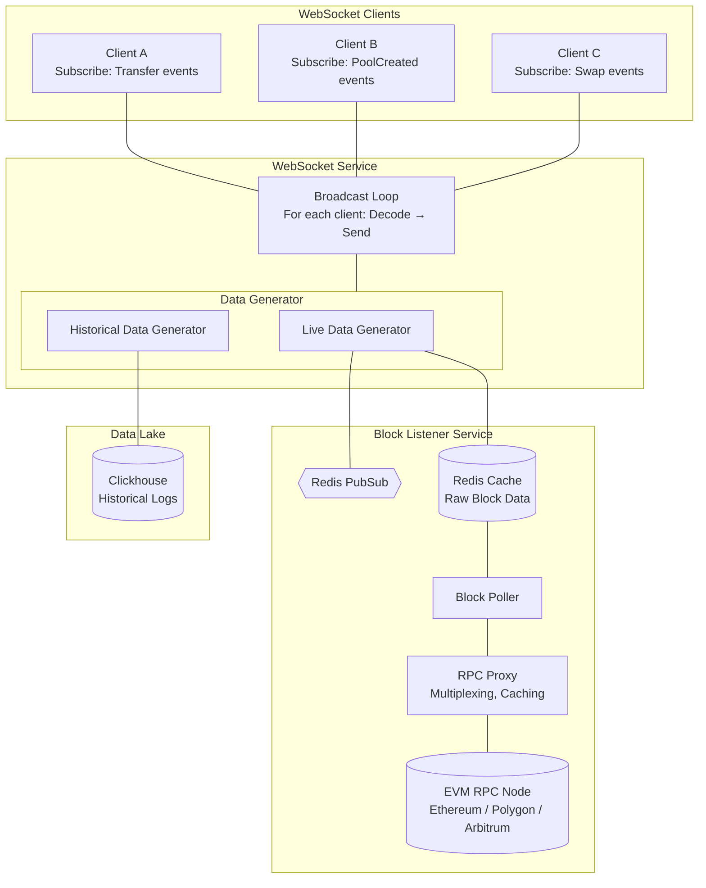

# evm-event-indexer

## Table of Contents

- [WebSocket Service](#websocket-service)
  - [Overview](#overview)
  - [Connection](#connection)
    - [Using wscat](#using-wscat)
  - [Subscription Message](#subscription-message)
    - [Request Format](#request-format)
    - [Request Parameters](#request-parameters)
  - [Response Format](#response-format)
    - [Decoded Events Response](#decoded-events-response)
    - [Raw Events Response](#raw-events-response)
    - [Response Fields](#response-fields)
  - [Example Usage](#example-usage)
    - [Listening to Uniswap V3 Factory Pool Creation (Decoded)](#listening-to-uniswap-v3-factory-pool-creation-decoded)
    - [Multiple Event Subscriptions](#multiple-event-subscriptions)
    - [Listen to All Contracts](#listen-to-all-contracts)
  - [Notes](#notes)
- [WebSocket Architecture Design](#websocket-architecture-design)
  - [Scanning Historical Logs](#scanning-historical-logs)
    - [Historical Scan Module](#historical-scan-module)
  - [Listening to New Logs](#listening-to-new-logs)
- [ABI Repository Service](#abi-repository-service)
  - [How to Efficiently Decode Events](#how-to-efficiently-decode-events)
    - [Case 1: Event Signature Matches a Single ABI](#case-1-event-signature-matches-a-single-abi)
    - [Case 2: Event Signature Matches Multiple ABIs](#case-2-event-signature-matches-multiple-abis)
  - [Data Store](#data-store)
    - [Table 1: topic_0 to ABI](#table-1-topic_0-to-abi)
    - [Table 2: Address to Event ABI](#table-2-address-to-event-abi)
    - [Table 3: Event ABI Lookup (Extension)](#table-3-event-abi-lookup-extension)
    - [Query 1: Fetch All ABIs for a topic_0](#query-1-fetch-all-abis-for-a-topic_0)
    - [Query 2: Fetch ABIs for a Set of Addresses](#query-2-fetch-abis-for-a-set-of-addresses)
    - [Why Postgres?](#why-postgres)
  - [Updating the ABI Repository](#updating-the-abi-repository)
    - [Factory Contract Listener](#factory-contract-listener)
    - [Fetching ABIs](#fetching-abis)
    - [Checkpointing](#checkpointing)

---

# WebSocket Service

Real-time EVM event streaming service for subscribing to blockchain events with optional decoding.

## Overview

The WebSocket service enables clients to receive real-time notifications for specific EVM events. You can subscribe to events by specifying contract addresses, event signatures (topic_0), and whether you want the events decoded or returned in raw format.

## Connection

Connect to the WebSocket endpoint:

```
wss://stream.yourdomain.com/v1/events
```

### Using wscat

Install wscat if you haven't already:

```bash
npm install -g wscat
```

Connect to the service:

```bash
wscat -c wss://stream.yourdomain.com/v1/events
```

## Subscription Message

After connecting, send a subscription message to start receiving events.

### Request Format

```json
{
  "type": "subscribe",
  "chain": "ethereum",
  "decode": true,
  "from_block": 18500000,
  "topics": [
    "0x783cca1c0412dd0d695e784568c96da2e9c22ff989357a2e8b1d9b2b4e6b7118",
    "0xddf252ad1be2c89b69c2b068fc378daa952ba7f163c4a11628f55a4df523b3ef"
  ],
  "addresses": [
    "0x1F98431c8aD98523631AE4a59f267346ea31F984",
    "0xC02aaA39b223FE8D0A0e5C4F27eAD9083C756Cc2"
  ]
}
```

### Request Parameters

| Parameter | Type | Required | Description |
|-----------|------|----------|-------------|
| `type` | string | Yes | Must be `"subscribe"` to initiate a subscription |
| `chain` | string | Yes | The blockchain network (e.g., `"ethereum"`, `"polygon"`, `"arbitrum"`) |
| `decode` | boolean | Yes | Whether to decode events (`true`) or return raw logs (`false`) |
| `from_block` | integer | No | Block number to start scanning/listening from. If omitted, starts from the latest block |
| `topics` | array | Yes | Array of event signature hashes (topic_0) to monitor |
| `addresses` | array | No | Array of contract addresses to monitor. If omitted, listens to all contracts emitting the specified topics |

## Response Format

The service streams events matching your filters in real-time. Each message includes the block number and an array of events from that block.

### Decoded Events Response

When `decode: true`, events are returned with parsed parameters:

```json
{
  "block_number": 18500123,
  "data": [
    {
      "event_name": "PoolCreated",
      "address": "0x1F98431c8aD98523631AE4a59f267346ea31F984",
      "transaction_hash": "0xabc123...",
      "log_index": 42,
      "parameters": {
        "token0": "0xA0b86991c6218b36c1d19D4a2e9Eb0cE3606eB48",
        "token1": "0xC02aaA39b223FE8D0A0e5C4F27eAD9083C756Cc2",
        "fee": 3000,
        "tickSpacing": 60,
        "pool": "0x8ad599c3A0ff1De082011EFDDc58f1908eb6e6D8"
      }
    }
  ]
}
```

### Raw Events Response

When `decode: false`, events are returned as raw log objects:

```json
{
  "block_number": 18500123,
  "data": [
    {
      "address": "0x1F98431c8aD98523631AE4a59f267346ea31F984",
      "topics": [
        "0x783cca1c0412dd0d695e784568c96da2e9c22ff989357a2e8b1d9b2b4e6b7118",
        "0x000000000000000000000000a0b86991c6218b36c1d19d4a2e9eb0ce3606eb48",
        "0x000000000000000000000000c02aaa39b223fe8d0a0e5c4f27ead9083c756cc2"
      ],
      "data": "0x0000000000000000000000000000000000000000000000000000000000000bb8000000000000000000000000000000000000000000000000000000000000003c0000000000000000000000008ad599c3a0ff1de082011efddc58f1908eb6e6d8",
      "block_hash": "0xdef456...",
      "block_number": 18500123,
      "transaction_hash": "0xabc123...",
      "transaction_index": 15,
      "log_index": 42,
      "removed": false
    }
  ]
}
```

### Response Fields

#### Common Fields

| Field | Type | Description |
|-------|------|-------------|
| `block_number` | integer | The block number where the event(s) occurred |
| `data` | array | Array of event objects (decoded or raw based on subscription) |

#### Decoded Event Fields

| Field | Type | Description |
|-------|------|-------------|
| `event_name` | string | Human-readable name of the event |
| `address` | string | Contract address that emitted the event |
| `transaction_hash` | string | Transaction hash containing the event |
| `log_index` | integer | Index of the log within the block |
| `parameters` | object | Decoded event parameters as key-value pairs |

#### Raw Event Fields

| Field | Type | Description |
|-------|------|-------------|
| `address` | string | Contract address that emitted the event |
| `topics` | array | Array of indexed event parameters (topic_0 is event signature) |
| `data` | string | Non-indexed event parameters as hex-encoded data |
| `block_hash` | string | Hash of the block containing this log |
| `block_number` | integer | Block number containing this log |
| `transaction_hash` | string | Transaction hash containing the event |
| `transaction_index` | integer | Transaction's index position in the block |
| `log_index` | integer | Log's index position in the block |
| `removed` | boolean | Whether the log was removed due to chain reorganization |

## Example Usage

### Listening to Uniswap V3 Factory Pool Creation (Decoded)

```bash
# Connect
wscat -c wss://stream.yourdomain.com/v1/events

# Send subscription (specific contract)
> {
  "type": "subscribe",
  "chain": "ethereum",
  "decode": true,
  "topics": [
    "0x783cca1c0412dd0d695e784568c96da2e9c22ff989357a2e8b1d9b2b4e6b7118"
  ],
  "addresses": [
    "0x1F98431c8aD98523631AE4a59f267346ea31F984"
  ]
}

# Receive events
< {
  "block_number": 18500123,
  "data": [
    {
      "event_name": "PoolCreated",
      "address": "0x1F98431c8aD98523631AE4a59f267346ea31F984",
      "transaction_hash": "0xabc123...",
      "log_index": 42,
      "parameters": {
        "token0": "0xA0b86991c6218b36c1d19D4a2e9Eb0cE3606eB48",
        "token1": "0xC02aaA39b223FE8D0A0e5C4F27eAD9083C756Cc2",
        "fee": 3000,
        "tickSpacing": 60,
        "pool": "0x8ad599c3A0ff1De082011EFDDc58f1908eb6e6D8"
      }
    }
  ]
}
```

### Multiple Event Subscriptions

You can subscribe to multiple events and contracts in a single connection:

```json
{
  "type": "subscribe",
  "chain": "ethereum",
  "decode": true,
  "topics": [
    "0x783cca1c0412dd0d695e784568c96da2e9c22ff989357a2e8b1d9b2b4e6b7118",
    "0xddf252ad1be2c89b69c2b068fc378daa952ba7f163c4a11628f55a4df523b3ef"
  ],
  "addresses": [
    "0x1F98431c8aD98523631AE4a59f267346ea31F984",
    "0xC02aaA39b223FE8D0A0e5C4F27eAD9083C756Cc2"
  ]
}
```

### Listen to All Contracts

Omit the `addresses` field to monitor events across all contracts:

```json
{
  "type": "subscribe",
  "chain": "ethereum",
  "decode": false,
  "topics": [
    "0xddf252ad1be2c89b69c2b068fc378daa952ba7f163c4a11628f55a4df523b3ef"
  ]
}
```

This will stream all ERC-20 Transfer events from any contract on Ethereum.

## Notes

- The WebSocket connection will stream events in real-time as they are confirmed on the blockchain
- Events from the same block are batched together in the response
- Ensure your event signature (topic_0) matches the keccak256 hash of the event signature (e.g., `PoolCreated(address,address,uint24,int24,address)`)
- For decoded events, the service must have the ABI for the contract to properly decode parameters
- When `addresses` is omitted, the service monitors all contracts for the specified topics (use with caution on high-volume events)
- The service matches events where topic_0 is in your `topics` list AND (if specified) the contract address is in your `addresses` list

---

# WebSocket Architecture Design

The WebSocket service supports both historical log scanning and real-time event streaming using a unified Data Generator pattern.



## Scanning Historical Logs

Query and decode past blockchain events from the data lake.

### How It Works

- Client sends subscription with `from_block` set to a past block number
- **Historical Data Generator** queries Clickhouse for raw logs starting from that block
- Logs are decoded and streamed back to client in block order
- Once caught up to present, generator switches to live mode

### Historical Scan Module

- The Historical Data Generator uses a standalone module with a Clickhouse client optimized for scanning
- This module can be imported directly into other code — no WebSocket connection required
- Use it to scan historical data programmatically from any service or script
- Bypassing WebSocket can achieve higher throughput

## Listening to New Logs

Stream decoded events in real-time as new blocks are confirmed.

### How It Works

- **Block Listener Service** polls the RPC node for new blocks and writes raw logs to Redis cache
- **Redis Pub/Sub** emits a notification when new block data is cached
- **Live Data Generator** receives notification, reads raw data from cache
- Logs are decoded and streamed to connected clients matching their subscription filters

### Why Shared Cache?

- **Client Reconnection** — resume from last processed block by reading older cache entries
- **Service Restart** — continue from last block by traversing the cache
- **Decoupled Architecture** — block polling and client delivery are independent

---

# ABI Repository Service

Service that stores and retrieves event ABIs for decoding blockchain events.

## How to Efficiently Decode Events

For each chain, for each block, we receive raw logs from the RPC. We need to:

- **Filter relevant logs** — select only logs where `topic_0` matches event signatures provided by the client
- **Decode quickly** — expect 100-200 relevant events per block (typical case is < 5)

### Case 1: Event Signature Matches a Single ABI

Most common scenario:

- `topic_0` maps to exactly one event ABI
- Fetch the ABI directly from the repository
- Use it to decode all matching events across any contract

**Example:**
```
topic_0: 0xddf252ad1be2c89b69c2b068fc378daa952ba7f163c4a11628f55a4df523b3ef
→ Transfer(address,address,uint256)
```

### Case 2: Event Signature Matches Multiple ABIs

When `topic_0` maps to multiple event ABIs:

- Cannot use `topic_0` alone to determine correct ABI
- Must disambiguate using the log's `address` field
- Each contract address maps to exactly one event ABI

**Why this happens:**
- Different contracts can emit events with same signature but different parameter names
- Indexed vs non-indexed parameters can differ

**Solution:**
- Look up the ABI by contract `address` instead of `topic_0`
- Must be fast — potentially 200 lookups per block

## Data Store

Postgres with 2 tables. Uses indices for fast lookups.

**Extension:** Add a 3rd table to integer-encode event ABIs for better storage efficiency (see [Table 3](#table-3-event-abi-lookup-extension)).

### Table 1: topic_0 to ABI

Maps event signatures to their ABIs.

```sql
CREATE TABLE topic_0_to_abi (
    topic_0 BYTEA NOT NULL,
    event_abi JSONB NOT NULL,
    PRIMARY KEY (topic_0, event_abi)
);

CREATE INDEX idx_topic_0 ON topic_0_to_abi (topic_0);
```

### Table 2: Address to Event ABI

Maps contract addresses to their event ABIs.

```sql
CREATE TABLE address_to_event_abi (
    address BYTEA NOT NULL,
    event_abi JSONB NOT NULL,
    PRIMARY KEY (address, event_abi)
);

CREATE INDEX idx_address ON address_to_event_abi (address);
```

### Table 3: Event ABI Lookup (Extension)

Optional table that stores ABIs once with an integer ID. Reduces storage when same ABI is referenced by many addresses.

```sql
CREATE TABLE event_abi_lookup (
    abi_id SERIAL PRIMARY KEY,
    event_abi JSONB NOT NULL UNIQUE
);
```

With this extension, Table 1 and Table 2 store `abi_id` (INTEGER) instead of `event_abi` (JSONB):

- **Before:** Each row duplicates the full JSONB ABI
- **After:** Each row stores a 4-byte integer reference

### Query 1: Fetch All ABIs for a topic_0

Used in Case 1 to check if signature maps to single or multiple ABIs.

```sql
SELECT event_abi 
FROM topic_0_to_abi 
WHERE topic_0 = $1;
```

### Query 2: Fetch ABIs for a Set of Addresses

Used in Case 2 when disambiguation is needed.

```sql
SELECT address, event_abi 
FROM address_to_event_abi 
WHERE address = ANY($1);
```

### Why Postgres?

- **Persistent** — not practical to keep everything in memory
- **Client-server** — access from anywhere + good tooling and UI support
- **Fast enough** — indices make lookups quick for our use case

## Updating the ABI Repository

### Factory Contract Listener

- Service listens to contract creation transactions from configured factory contracts
- API endpoint allows adding/removing factory contracts to monitor
- When a new contract is created by a factory, update the ABI repository

### Fetching ABIs

- If new contract differs from previously seen contracts, fetch ABI from Etherscan API
- Store the ABI mapping in both tables

### Checkpointing

- Checkpoint each processed block number
- WebSocket Service waits for ABI repository to catch up to a block before processing it
- Ensures ABIs are available before decoding events
